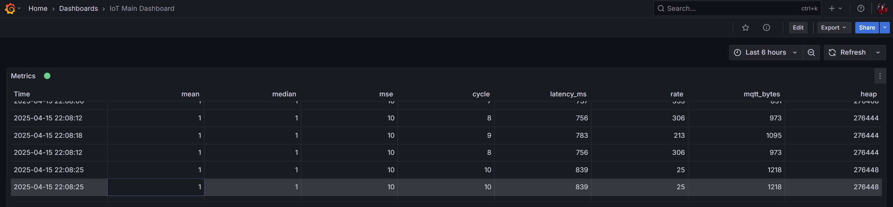
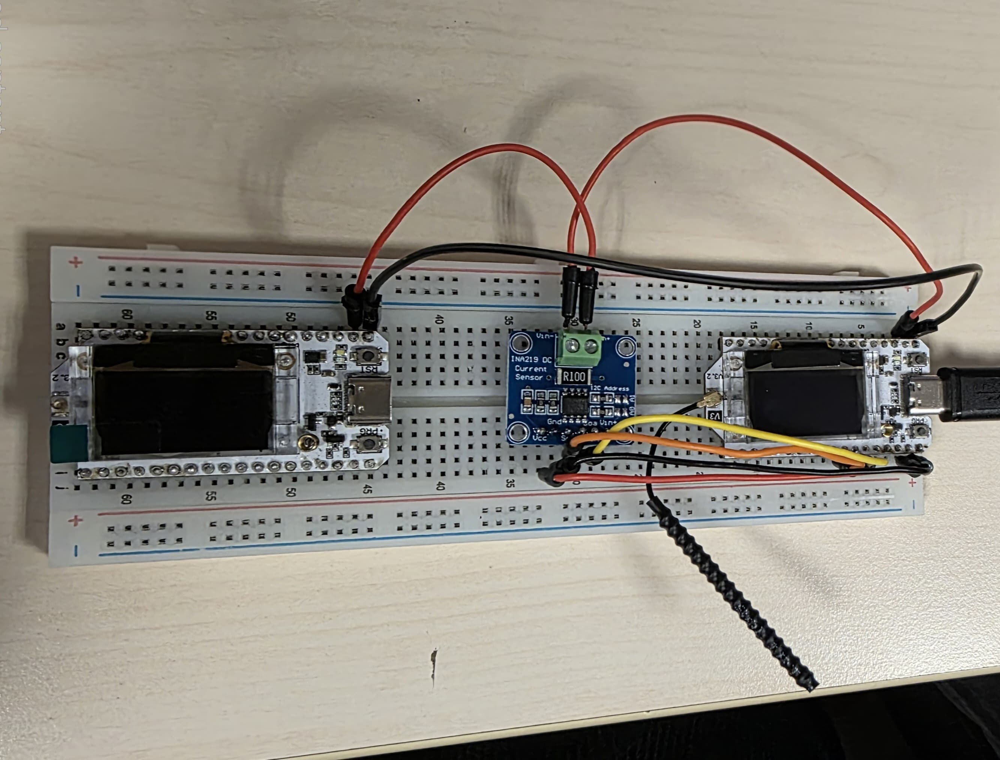
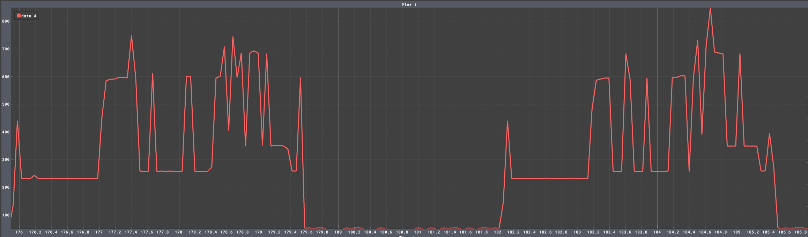

# ESP32 Adaptive Sampling using FFT with MQTT, WiFi/LoRaWAN & AWS IoT Core

This project describes an ESP32-based application for sampling sensor data, performing Fast Fourier Transform (FFT) analysis, aggregating statistical metrics, publishing results via MQTT, and monitoring system performance. Built with FreeRTOS for task management, it optimizes resource usage and employs deep sleep for power efficiency. The application is designed for IoT use cases like signal analysis or environmental monitoring, with support for visualization in Grafana, integration with LoRaWAN via The Things Network (TTN) and connection to AWS IoT Core.

## Table of Contents
- [ESP32 Adaptive Sampling using FFT with MQTT, WiFi/LoRaWAN \& AWS IoT Core](#esp32-adaptive-sampling-using-fft-with-mqtt-wifilorawan--aws-iot-core)
  - [Table of Contents](#table-of-contents)
  - [Overview](#overview)
  - [What the Code Does](#what-the-code-does)
  - [System Architecture](#system-architecture)
    - [Tasks](#tasks)
    - [Shared Resources](#shared-resources)
    - [RTC Memory](#rtc-memory)
  - [Phases of Operation](#phases-of-operation)
  - [Data Flow](#data-flow)
  - [Design Choices and Rationale](#design-choices-and-rationale)
  - [Demo Output](#demo-output)
  - [Configuration Parameters](#configuration-parameters)
  - [Dependencies](#dependencies)
  - [Error Handling and Reliability](#error-handling-and-reliability)
  - [Grafana Visualization](#grafana-visualization)
  - [Power Consumption](#power-consumption)
  - [Hands-On Walkthrough](#hands-on-walkthrough)
    - [Prerequisites](#prerequisites)
    - [Step-by-Step Setup](#step-by-step-setup)
    - [Setting Up LoRaWAN with TTN](#setting-up-lorawan-with-ttn)
    - [Setting up AWS IoT Core](#setting-up-aws-iot-core)
    - [Successful Connection with AWS IoT Core](#successful-connection-with-aws-iot-core)
    - [Troubleshooting](#troubleshooting)

## Overview
The application runs on an ESP32 microcontroller, leveraging its dual-core processor and FreeRTOS to manage concurrent tasks. It generates synthetic sensor data, processes it to extract frequency components, computes statistics, and publishes results to an MQTT broker over WiFi. Performance metrics (e.g., latency, heap usage) are tracked, and deep sleep reduces power consumption between cycles. The system supports visualization of aggregated data in Grafana and adapted for LoRaWAN connectivity via TTN for low-power, long-range communication.

## What the Code Does
The code implements a pipeline for processing and transmitting sensor data:

1. **Find maximum sampling rate**: 
    - Measures the maximum achievable sampling rate by collecting 10,000 ADC samples and calculating the rate based on elapsed time
    - Achieving a maximum of 32 kHz on the Heltec ESP32 V3.
    - Code: [Maximum Sampling Rate](https://github.com/najeh-halawani/IoT-Adaptive-Sampling-MQTT-LoRa/blob/main/find_max_sampling_rate/find_max_sampling_rate.ino)
  
2. **Data Sampling**:
   - Generates a synthetic signal (150 Hz + 160 Hz sine waves) to mimic sensor input.
   - Uses double-buffering (`sample_buffer_1`, `sample_buffer_2`) with `write_buffer` and `read_buffer` pointers to ensure concurrent sampling and processing.
   - Protected by `xSampleBufferMutex` for thread-safe access.

3. **FFT Analysis**:
   - Uses `ArduinoFFT` to compute the dominant frequency.
   - Adjusts sampling rate dynamically (2.5x max frequency, Nyquist criterion).

4. **Data Aggregation**:
   - Calculates mean, median, and mean squared error (MSE) over a 5-second window.
   - Prepares metrics for transmission.

5. **MQTT Publishing**:
   - Connects to WiFi and an MQTT broker (`test.mosquitto.org`).
   - Publishes metrics to `topic/data`.

6. **Performance Monitoring**:
   - Tracks latency, heap usage, and MQTT data volume.
   - Publishes JSON-formatted metrics via MQTT.

7. **Power Management**:
   - Enters deep sleep for 3 seconds per cycle.
   - Preserves state in RTC memory.

**Key Features**:
- Concurrent task execution with FreeRTOS.
- Double-buffering with mutex protection for seamless data handling.
- Dynamic sampling rate for efficiency.
- Robust synchronization using mutexes and semaphores.
- Support for Grafana visualization and LoRaWAN integration.

## System Architecture
The application uses five FreeRTOS tasks, pinned to the ESP32’s dual cores for load balancing. FreeRTOS primitives (queues, mutexes, semaphores) ensure synchronization and data integrity.

### Tasks
- **Sampling Task** (`vSamplingTask`, Core 0, Priority 5): Generates signal data and manages buffer swaps.
- **FFT Task** (`vFFTTask`, Core 1, Priority 3): Extracts frequency components.
- **Aggregate Task** (`vAggregateTask`, Core 1, Priority 3): Computes statistics.
- **MQTT Task** (`vMQTTTask`, Core 0, Priority 2): Handles WiFi/MQTT communication.
- **Performance Task** (`vPerformanceTask`, Core 1, Priority 2): Publishes metrics.

### Shared Resources
- **Buffers**:
  - `sample_buffer_1`, `sample_buffer_2`: Two 128-sample float buffers for double-buffering.
  - `write_buffer`: Points to the buffer being written by `vSamplingTask`.
  - `read_buffer`: Points to the buffer being read by `vFFTTask` and `vAggregateTask`.
  - Protected by `xSampleBufferMutex` to prevent concurrent access.
  - Buffer states (`BUFFER_WRITING`, `BUFFER_READY`, `BUFFER_READING`) track usage.
- **Queues**:
  - `xFFTResultQueue`: Passes `FFTResult_t` (frequency, magnitude, rate).
  - `xAggregateQueue`: Passes `AggregateResult_t` (mean, median, MSE).
- **Mutexes**:
  - `xSampleBufferMutex`: Guards buffer access and swaps.
  - `xAggregateMutex`: Protects aggregate data.
- **Semaphores**:
  - `xBufferReadySemaphore`: Signals buffer readiness from Sampling to FFT Task.
  - `xTaskCompleteSemaphore`: Tracks task completion.
  - `xMQTTCompleteSemaphore`: Synchronizes MQTT and Performance Tasks.

### RTC Memory
Stores `current_sample_rate`, `cycle_count`, `mqtt_bytes_sent_total`, `total_latency_us`, `latency_count`, and `boot_count` to persist across sleep cycles.

## Phases of Operation
The application executes three phases per cycle:

1. **Initialization (Setup Phase)**:
   - Initializes serial output (115200 baud).
   - Checks wakeup reason to reset state if needed.
   - Configures WDT (15-second timeout).
   - Allocates `sample_buffer_1`, `sample_buffer_2`, and FreeRTOS primitives.
   - Initializes `write_buffer` as `sample_buffer_1`, `read_buffer` as `sample_buffer_2`.
   - Connects to WiFi/MQTT.
   - Launches tasks.

2. **Processing (Task Execution Phase)**:
   - Sampling fills `write_buffer`, swaps buffers (`write_buffer` ↔ `read_buffer`), signals FFT via `xBufferReadySemaphore`.
   - FFT computes dominant frequency from `read_buffer`.
   - Aggregation calculates statistics.
   - MQTT publishes results.
   - Performance publishes metrics.
   - Tasks are synchronized via semaphores/queues/mutexes.

3. **Sleep (Shutdown Phase)**:
   - Waits for task completion (12-second timeout).
   - Increments `cycle_count` and sleeps for 3 seconds.
   - Preserves state in RTC memory.

## Data Flow
Data moves through tasks in a pipeline:

1. **Sampling Task**:
   - Signal: `2.0 * sin(2π * 150 * t) + 4.0 * sin(2π * 160 * t)`.
   - Writes to `write_buffer` (e.g., `sample_buffer_1`), protected by `xSampleBufferMutex`.
   - Swaps buffers: `write_buffer` becomes `sample_buffer_2`, `read_buffer` becomes `sample_buffer_1`.
   - Updates `buffer_1_state`, `buffer_2_state`, signals FFT via `xBufferReadySemaphore`.
   - **Output**: 128-sample buffer.

2. **FFT Task**:
   - Waits for `xBufferReadySemaphore`, reads `read_buffer` via `xSampleBufferMutex`.
   - Applies FFT (Hamming window), computes `max_frequency`, sets `new_sample_rate = 2.5 * max_frequency`.
   - Sends `FFTResult_t` to `xFFTResultQueue`.
   - **Output**: `{ max_frequency, max_magnitude, new_sample_rate }`.

3. **Aggregate Task**:
   - Receives `FFTResult_t`, reads `read_buffer` via `xSampleBufferMutex`.
   - Computes `mean`, `median`, `mse` over 5 seconds.
   - Sends `AggregateResult_t` to `xAggregateQueue`.
   - **Output**: `{ mean, median, mse }`.

4. **MQTT Task**:
   - Receives `AggregateResult_t`, stores in `aggregate_result` via `xAggregateMutex`.
   - Signals Performance Task (`xMQTTCompleteSemaphore`).
   - Tracks latency.
   - **Output**: Stored metrics, latency.

5. **Performance Task**:
   - Waits for `xMQTTCompleteSemaphore`, retrieves `aggregate_result` via `xAggregateMutex`.
   - Publishes JSON:
     ```json
     {
       "mean": <float>,
       "median": <float>,
       "mse": <float>,
       "cycle": <int>,
       "latency_ms": <float>,
       "rate": <int>,
       "mqtt_bytes": <int>,
       "heap": <int>
     }
     ```
   - **Output**: MQTT message.

**Synchronization**:
- `xSampleBufferMutex` ensures safe buffer access and swaps.
- `xBufferReadySemaphore` coordinates Sampling and FFT Tasks.
- Queues enable asynchronous data transfer.
- Semaphores enforce task order.

## Design Choices and Rationale
Key decisions enhance efficiency and reliability:

1. **Double-Buffering with Mutex**:
   - **Why**: Enables concurrent sampling and processing without data corruption.
   - **How**: `sample_buffer_1` and `sample_buffer_2` alternate as `write_buffer` and `read_buffer`, protected by `xSampleBufferMutex`.
   - **Example**: Sampling writes to `sample_buffer_1` while FFT reads `sample_buffer_2`.

2. **Buffer States**:
   - **Why**: Tracks buffer availability (`BUFFER_WRITING`, `BUFFER_READY`, `BUFFER_READING`).
   - **How**: Updated during swaps, checked by FFT/Aggregate Tasks.
   - **Example**: Ensures FFT only reads `BUFFER_READY` buffers.

3. **Dynamic Sampling Rate**:
   - **Why**: Saves power by matching rate to signal needs.
   - **How**: Rate set to `2.5 * max_frequency` (10–2000 Hz).
   - **Example**: 150 Hz signal yields ~375 Hz rate, reducing CPU usage vs. 32 kHz.

4. **FreeRTOS and Task Prioritization**:
   - **Why**: Ensures real-time sampling isn’t delayed.
   - **How**: Sampling (priority 5) on core 0, FFT/Aggregate (3) on core 1.
   - **Example**: Core separation balances load.

5. **Deep Sleep**:
   - **Why**: Extends battery life.
   - **How**: 3-second sleep, RTC memory for state.
   - **Example**: ~40% duty cycle (2 seconds active, 3 seconds asleep).

6. **Watchdog Timer**:
   - **Why**: Recovers from hangs.
   - **How**: 15-second timeout.
   - **Example**: Resets if FFT stalls.

7. **MQTT**:
   - **Why**: Lightweight IoT protocol.
   - **How**: Publishes to `test.mosquitto.org`.
   - **Example**: JSON enables easy parsing.

## Demo Output

```cpp
 --- Boot Count: 1 ---
Wakeup Reason: 0 (Power-On, Reset, or Other)
Cycle Count: 0
Current Sample Rate: 2000 Hz
Configuring Task Watchdog Timer...
Task WDT Deinitialized (was running).
Task WDT Initialized.
Main task added to WDT.
Sample buffers allocated and initialized.
Queues created.
Mutexes and Semaphores created.
Connecting to WiFi SSID: demo
....
WiFi connected!
IP Address: 192.168.137.91
Connecting MQTT to test.mosquitto.org:1883...
MQTT connected!
FFTTask: Subscribed to WDT
FFTTask started at 2821393, rate 2000 Hz
FFTTask: Waiting for buffer ready signal
SamplingTask started at 2821310, rate 2000 Hz
AggregateTask: Subscribed to WDT
AggregateTask started at 2831835
AggregateTask: Waiting for FFT result
PerformanceTask: Subscribed to WDT
PerformanceTask started at 2842169
PerformanceTask: Waiting for MQTTTask
--- Setup Complete ---

SamplingTask: Buffer states - Buf1: 1, Buf2: 0
SamplingTask: Buffer swapped successfully
SamplingTask: Signaled buffer ready
FFTTask: Received buffer ready signal
SamplingTask complete (Success)
MQTTTask: Subscribed to WDT
MQTTTask started at 2907832
MQTTTask: Waiting for aggregate values
FFTTask: Maximum Frequency 156.00 Hz
FFTTask: Adjusting rate to 390 Hz
FFTTask: Sent result to Aggregate queue
FFTTask complete (Success)
AggregateTask: Received FFT result
AggregateTask: Sent aggregate results to MQTT queue
MQTTTask: Received aggregate results
MQTTTask: Mean=0.10, Median=0.07, MSE=8.45
AggregateTask complete (Success), Mean = 0.10, Median = 0.07, MSE = 8.45
MQTTTask: Stored Mean=0.10, Median=0.07, MSE=8.45
PerformanceTask: MQTTTask completed
MQTTTask: Latency: 191306 us
MQTTTask complete (Success)
PerformanceTask: Read Mean=0.10, Median=0.07, MSE=8.45
PerformanceTask: Publishing JSON: {"mean":0,"median":0,"mse":8,"cycle":0,"latency_ms":0,"rate":390,"mqtt_bytes":0,"heap":277520}
MQTT published to demo/sensor/metrics: {"mean":0,"median":0,"mse":8,"cycle":0,"latency_ms":0,"rate":390,"mqtt_bytes":0,"heap":277520}
PerformanceTask complete (Success)
Loop: All tasks completed.
Cycle 1 finished. Sleeping for 3.00 seconds...
```

## Configuration Parameters
| Constant                  | Value        | Description                                      |
|---------------------------|--------------|--------------------------------------------------|
| `BUFFER_SIZE`             | 128          | Samples per buffer                               |
| `WINDOW_SEC`              | 5            | Aggregation window (seconds)                     |
| `MIN_SAMPLE_RATE`         | 10           | Min sampling rate (Hz)                           |
| `MAX_SAMPLE_RATE`         | 2000         | Max sampling rate (Hz)                           |
| `SLEEP_DURATION_US`       | 3000000      | Sleep duration (µs, 3s)                          |
| `WIFI_RECONNECT_ATTEMPTS` | 10           | Max WiFi retries                                 |
| `MQTT_RECONNECT_ATTEMPTS` | 5            | Max MQTT retries                                 |
| `TASK_PRIORITY_*`         | 2–5          | Task priorities                                  |
| `STACK_SIZE_*`            | 4096–8192    | Task stack sizes (bytes)                         |
| `WIFI_SSID`               | "demo"     | WiFi SSID                                        |
| `WIFI_PASSWORD`           | "demo" | WiFi password                                    |
| `MQTT_SERVER`             | "test.mosquitto.org" | MQTT broker                              |
| `MQTT_PORT`               | 1883         | MQTT port                                        |
| `MQTT_TOPIC_METRICS`      | "sensor/metrics" | MQTT topic                            |

**Rationale**:
- `BUFFER_SIZE = 128`: FFT-friendly, memory-efficient.
- `WINDOW_SEC = 5`: Balances statistics and computation.
- `SLEEP_DURATION_US = 3000000`: Frequent updates, low power.

## Dependencies
- **FreeRTOS**: Task management (ESP32 Arduino core).
- **WiFi**: ESP32 WiFi (Arduino core).
- **PubSubClient**: MQTT communication.
- **ArduinoFFT**: FFT analysis.
- **ArduinoJson**: JSON serialization.
- **ESP32 Core**: ADC, timers, sleep, WDT.

Install via Arduino IDE or PlatformIO.

## Error Handling and Reliability
- **Memory Checks**: Validates allocations for `sample_buffer_1`, `sample_buffer_2`, restarts on failure.
- **Mutex Timeouts**: 200 ms timeout for `xSampleBufferMutex`, logs errors.
- **Semaphore Timeouts**: Task waits (e.g., 10 seconds for `xBufferReadySemaphore`) prevent deadlocks.
- **Watchdog**: 15-second reset.
- **Reconnections**: WiFi (10 retries), MQTT (5 retries).
- **RTC Memory**: Preserves state.
- **Degradation**: Continues processing if WiFi/MQTT fails.

**Example**: `vSamplingTask` logs mutex timeouts and proceeds to sleep.

## Grafana Visualization
Grafana enables real-time visualization of aggregated metrics (`mean`, `median`, `mse`, `latency_ms`, `rate`, `heap`) as a table, providing insights into signal behavior and system performance.

- **Purpose**: Monitor trends, e.g., signal stability (`mean` ~0.0, `mse` ~4.0) or processing delays (`latency_ms`).
- **Setup**: Uses an MQTT data source to fetch JSON payloads from `sensor/metrics`.
- **Chart Types**: Table for multiple metrics.
- **Example Dashboard**:
  - **Mean**: Tracks signal average, expected ~0.0.
  - **MSE**: Shows signal variance, ~4.0 for synthetic signal.
  - **Latency**: Monitors processing time, typically 1000–2000 ms.
  - **Rate**: Displays sampling rate, e.g., ~375 Hz after FFT adjustment.
  - See screenshot:
    
    *Figure: Grafana dashboard showing time-series plots of mean, MSE, latency, and sampling rate.*

Detailed setup instructions are in the [Hands-On Walkthrough](#hands-on-walkthrough).

## Power Consumption
In this setup, we used two ESP32 boards and an INA219 power sensor. One ESP32 acts as the monitor, while the other functions as the load, running the target program. The INA219 is capable of measuring current, voltage, and power. It is connected to the monitoring ESP32 via the I2C interface using the SDA and SCL pins, and its VCC is connected to the 5V pin. On the load side, VIN+ is connected to the 5V output of the load, while VIN− is connected to the monitor ESP32 on the 5V pin. Additionally, a common ground is shared between the load and the monitor, which also serves as the power source in this setup.



**The chart below shows the power consumption (in milliwatts) of the ESP32 during its operation cycle.**

- Boot spike during startup.
- Stable ~250 mW during task initialization and sampling.
- Peaks up to ~700 mW during FFT analysis.
- Brief drops/spikes during task completion and queue transmission.
- Final spikes during aggregation and WiFi/MQTT transmission.
- Drops to near-zero in deep sleep (3 seconds).



Code: [Power Consumption Code](https://github.com/najeh-halawani/IoT-Adaptive-Sampling-MQTT-LoRa/blob/main/power_consumption_measure/power_consumption_measure.ino)

## Hands-On Walkthrough
This section guides you through setting up the ESP32 application, visualizing data in Grafana, and preparing for LoRaWAN with TTN.

### Prerequisites
- **Hardware**:
  - ESP32 board (e.g., ESP32-DevKitC).
  - USB cable.
  - (For LoRaWAN) LoRa-capable board (e.g., Heltec WiFi LoRa 32) or external module (e.g., SX1276).
  - (Optional) Computer for MQTT/Grafana.
- **Software**:
  - Arduino IDE or PlatformIO.
  - ESP32 board support (`espressif/arduino-esp32`, `v2.0.9+`).
  - Libraries: `PubSubClient`, `ArduinoFFT`, `ArduinoJson`.
  - (For Grafana) Docker or Grafana Cloud, MQTT broker (e.g., Mosquitto).
  - (For LoRaWAN) TTN account.
  - Serial monitor (Arduino IDE, PuTTY).
  - MQTT client (e.g., MQTT Explorer).

### Step-by-Step Setup
1. **Install Arduino IDE**:
   - Download from [arduino.cc](https://www.arduino.cc/en/software).
   - Install and open.

2. **Add ESP32 Support**:
   - `File > Preferences`.
   - Add to `Additional Boards Manager URLs`:
     ```
     https://raw.githubusercontent.com/espressif/arduino-esp32/gh-pages/package_esp32_index.json
     ```
   - `Tools > Board > Boards Manager`, install `esp32`.

3. **Install Libraries**:
   - `Sketch > Include Library > Manage Libraries`.
   - Install:
     - `PubSubClient` (Nick O’Leary).
     - `ArduinoFFT` (Enrique Condes).
     - `ArduinoJson` (Benoit Blanchon).
   - For PlatformIO, edit `platformio.ini`:
     ```ini
     lib_deps =
       knolleary/PubSubClient@^2.8
       kosme/ArduinoFFT@^2.0.2
       bblanchon/ArduinoJson@^6.21.0
     ```

4. **Configure the Code**:
   - Copy code to `esp32_sensor.ino`.
   - Update WiFi:
     ```cpp
     const char* WIFI_SSID = "YOUR_SSID";
     const char* WIFI_PASSWORD = "YOUR_PASSWORD";
     ```
   - (Optional) MQTT settings:
     ```cpp
     const char* MQTT_SERVER = "test.mosquitto.org";
     const int MQTT_PORT = 1883;
     const char* MQTT_TOPIC_METRICS = "topic/data";
     ```

5. **Connect ESP32**:
   - Connect via USB.
   - `Tools > Board > ESP32 Arduino > ESP32 Dev Module`.
   - Select port (`Tools > Port`, e.g., `COM3`).

6. **Upload Code**:
   - `Sketch > Upload`.
   - Resolve errors (check libraries, board, port).
   - Upload: ~10–20 seconds.

7. **Monitor Serial**:
   - `Tools > Serial Monitor`, 115200 baud.
   - Output:
     ```
     --- Boot Count: 1 ---
     Cycle Count: 0
     Current Sample Rate: 2000 Hz
     SamplingTask: Buffer swapped successfully
     FFTTask: Max freq = 150.00 Hz, Mag = ...
     PerformanceTask: Publishing JSON: {"mean":...,"median":...,...}
     Cycle 1 finished. Sleeping for 3.00 seconds...
     ```
   - Cycles every ~5 seconds (2 seconds active, 3 seconds sleep).

8. **Verify MQTT**:
   - Use MQTT Explorer ([mqttexplorer.com](http://mqttexplorer.com)).
   - Connect to `test.mosquitto.org:1883`, no credentials.
   - Subscribe to `sensor/metrics`.
   - Expect JSON:
     ```json
     {
       "mean": 0.0,
       "median": 0.0,
       "mse": 4.0,
       "cycle": 1,
       "latency_ms": 1500.0,
       "rate": 375,
       "mqtt_bytes": 256,
       "heap": 180000
     }
     ```

9. **Set Up Grafana**:
   - **Install Grafana**:
     - Docker:
       ```bash
       docker run -d -p 3000:3000 --name grafana grafana/grafana:latest
       ```
     - Or use Grafana Cloud ([grafana.com](https://grafana.com)).
     - Access: `http://localhost:3000`, login (`admin/admin`).
   - **Install MQTT Plugin**:
     - `Configuration > Plugins`, search `MQTT`, install `Grafana MQTT Data Source`.
     - Or:
       ```bash
       docker exec grafana grafana-cli plugins install grafana-mqtt-datasource
       ```
   - **Configure Data Source**:
     - `Configuration > Data Sources > Add data source`, select `MQTT`.
     - URL: `mqtt://test.mosquitto.org:1883`.
     - Topic: `sensor/metrics`.
     - No authentication.
     - Save and test.
   - **Create Dashboard**:
     - `Create > Dashboard > Add new panel`.
     - Query:
       - Data source: MQTT.
       - Topic: `sensor/metrics`.
       - Fields: `mean`, `median`, `mse`, `latency_ms`, `rate`, `heap`.
       - Format: Time series.
     - Visualization: Table.
     - Metrics:
       - `mean`: ~0.0.
       - `mse`: ~4.0.
       - `latency_ms`: 1000–2000 ms.
     - Time range: Last 1 hour.
     - Save.
   - **View**:
     - Updates every ~5 seconds.
     - Trends: Stable `mean`, varying `latency_ms`.
     - See [Grafana Visualization](#grafana-visualization) for screenshot.

### Setting Up LoRaWAN with TTN
The current code uses WiFi/MQTT, but you can register a device in The Things Network (TTN) for future LoRaWAN integration. This requires a LoRa-capable board (e.g., Heltec WiFi LoRa 32, TTGO LoRa32) or an external module (e.g., SX1276).

1. **Create TTN Account**:
   - Sign up at [thethingsnetwork.org](https://www.thethingsnetwork.org).
   - Log in to TTN Console.

2. **Verify Gateway**:
   - Ensure a TTN gateway is nearby ([ttnmapper.org](https://ttnmapper.org)).
   - Or register your own (e.g., RAKwireless) in TTN Console.

3. **Add Application**:
   - `Applications > Add application`.
   - Settings:
     - ID: `esp32-sensor-app`.
     - Name: `ESP32 Sensor App`.
   - Save.

4. **Add Device**:
   - In `esp32-sensor-app`, `Add end device`.
   - Manual registration:
     - **Parameters**:
       - **DevEUI**: Unique 8-byte device identifier (generate in TTN or use board-specific).
       - **AppEUI**: 8-byte application identifier (generate in TTN).
       - **AppKey**: 16-byte encryption key (generate in TTN).
     - Frequency plan: Match region (e.g., EU868, US915).
     - LoRaWAN version: 1.0.2.
   - Save.
   - Screenshot:
     
     *Figure: TTN Console showing device registration with DevEUI, AppEUI, and AppKey.*

### Setting up AWS IoT Core
1. Create AWS Account.
2. Create an API Key on The Things Stack.
   
3. Use the deployment guide from: [Deployment Guide](https://www.thethingsindustries.com/docs/integrations/cloud-integrations/aws-iot/deployment-guide/).
4. Select your AWS region.
   
5. Complete the Cloud Formation Stack Form.
   
6. Add your tenant and cluster region based on your The Things Stack application.
   

### Successful Connection with AWS IoT Core

*Figure: Successful Connection between ESP32 and IoT Core Service on AWS using TTN.*


*Figure: Successful MQTT Connection between ESP32 and IoT Core Service on AWS using TTN.*

### Troubleshooting
- **Serial**: Check 115200 baud, port.
- **WiFi**: Verify SSID/password.
- **MQTT**: Ping broker, check topic.
- **Buffers**: Check `xSampleBufferMutex` timeouts in serial logs.
- **Grafana**: Confirm MQTT source, topic.
- **AWS IoT Core**: Check application-id and API key.
- **TTN**: Ensure gateway, correct keys.